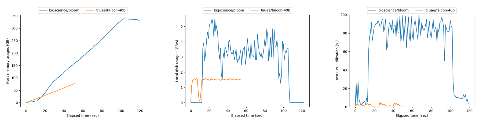
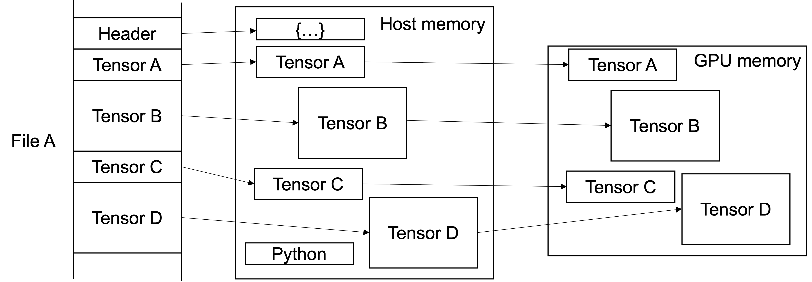
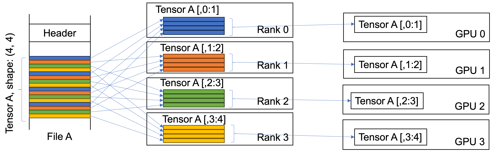
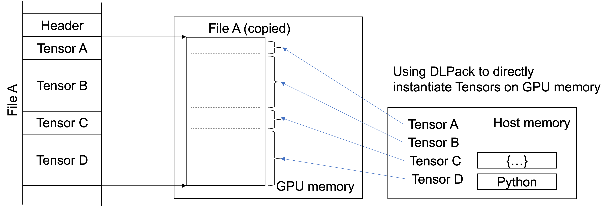
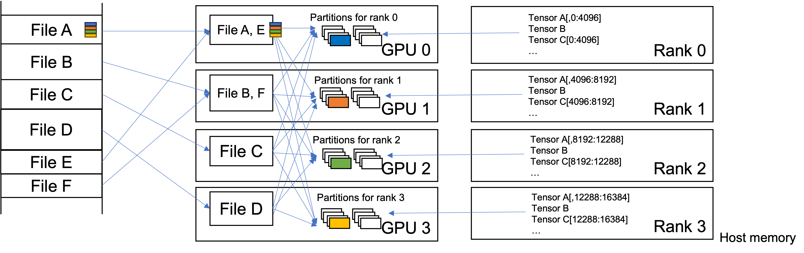
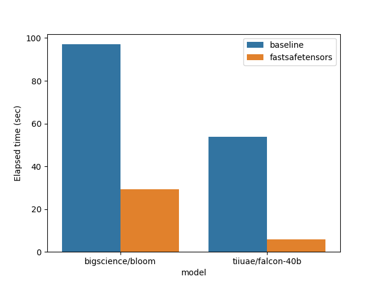
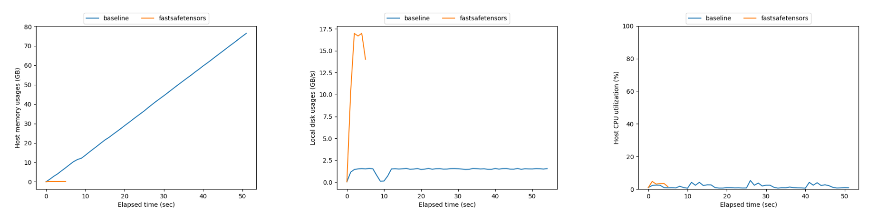
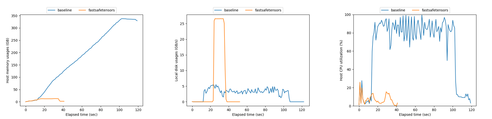

Fastsafetensors: Accelerating Model Loading for Large Language Models
====================

Fastsafetensors achieves a breakthrough in model loading times, delivering a remarkable 9.4x speedup on a single GPU and 4 NVMe SSDs. In this post, we'll describe the technology behind fastsafetensors (e.g., GPU Direct Storage and GPU-offloaded tensor sharding), and provide a detailed analysis of its performance and resource utilization.

## Background

Large language models (LLMs) have revolutionized the field of natural language processing, enabling applications such as language translation, text summarization, and chatbots. However, as these models continue to grow in size, a new challenge has emerged: slow startup time. The time it takes to load these massive models into GPU memory can be measured in minutes, not seconds, leading to frustrating delays.

The slow startup times of LLMs are a well-known pain point in the community. In response, developers have been actively seeking solutions to improve model loading efficiency. One notable development in this area is the introduction of the safetensors file format, designed to provide a more efficient and secure way of loading models compared to traditional pickle files.

However, despite the introduction of safetensors, the loading times of LLMs did not satisfy our requirements of inference server startup time even when the model files are preloaded in local NVMe SSDs. In our quest for even faster model loading, we've discovered that the current approach of file copies from persistent volumes to GPU memory is a major culprit, hindering the full potential of safetensors.

## Analysis of the safetensors loader

We collected resource utilization data while loading the bigscience/bloom and tiiuae/falcon-40b models using safe_open() in safetensors 0.3.3. Our test environment consisted of RHCOS 4.14 (Linux 5.14) with 80 Icelake CPUs and 1.2TB of DRAM. The models were stored on four 3.2TB NVMe SSDs, from which safetensors copied the files. The tensors were then copied to eight A100 GPUs for the Bloom model and a single GPU for the Falcon-40b model. The resulting figures are shown below.

The collected data reveals several areas for improvement in the current file loading process of safetensors files. Notably, the figures show a significant host memory consumption, largely attributed to bounce buffers. Furthermore, the four NVMe SSDs are underutilized, operating at a fraction of their maximum combined throughput of 28 GB/s (7 GB/s × 4 SSDs). Additionally, the CPU utilization for the Bloom model is excessively high, indicating that the host CPUs are overwhelmed with sharding tensors before copying them to GPU memory.

Upon further examination of the safetensors code, we identified two key design elements in the current file loader that contribute to the inefficient resource utilization: 1) the use of mmap to instantiate tensors one-by-one in host memory, and 2) the creation of too many small sharded tensors at host CPUs. Our analysis reveals that the root cause of these issues is the reliance on host CPUs and memory to handle complex tasks, which leads to suboptimal performance.

1) Instantiating tensors one-by-one at host memory. The current approach maps a tensor in a file to host memory, instantiates it, and then copies it to GPU memory. This process, implemented in Python, results in sequential file I/O, which can lead to significant performance bottlenecks.

2) Too many small sharded tensors at host CPUs. In the context of tensor parallelism, the current file loader requires users to retrieve partitioned tensors at host memory and then copy them to GPU memory. This approach leads to an excessive number of small tensor copies, which can cause significant overhead and slow down the loading process.

## Fastsafetensors

To address these issues, we require a radical design shift that bypasses host CPU and memory during file copies and sharding, echoing the motivation behind GPU Direct Storage. To achieve this, we have completely revamped the safetensors file loader and developed a new implementation from the ground up, dubbed "fastsafetensors". This optimized loader introduces three key features to accelerate model loading performance:

1. Batched, lazy tensor instantiations, which reduce the overhead of individual tensor loading.

2. GPU offloading for sharding, which leverages the GPU's processing power to handle complex tasks.

3. GPU Direct Storage enablement, allowing for direct file loading from NVMe SSDs to GPU memory, thereby minimizing host CPU and memory involvement.

Fastsafetensors changes the execution flow of file I/O to tensor instantiations. The primary cause of sequential file I/O was the need to instantiate each tensor individually when loading it into host memory. In contrast, fastsafetensors first transfers the entire tensor binaries in a file to GPU memory, and then lazily instantiates them as a group of tensors using DLPack. This is made possible by the safetensors format, which ensures that all tensors in a file are stored within a contiguous region. This new flow enables batched file I/O, paving the way for easy optimization with parallelized I/O and GPU Direct Storage.

The aforementioned optimization presents another challenge for tensor parallel inference. A straightforward approach would be to select the required file ranges for a rank and transfer them to GPU memory as partitioned tensors. However, this naive approach would result in numerous small, scattered file I/O operations on relatively high-latency devices, such as NVMe SSDs, similar to the original loader. To overcome this, we offload these computationally intensive tasks to GPUs, leveraging their memory and low-latency interconnects, specifically NVLink. Therefore, fastsafetensors first load each file to different GPUs in a round-robin fashion, and then broadcast and scatter tensor partitions to the GPUs that actually utilize them during tensor-parallel inference.

## Performance results

We have successfully tested fastsafetensors with several models, including tiiuae/falcon-40b and bigscience/bloom, and observed significant performance improvements across the board, accompanied by better resource utilization. With Falcon-40B, fastsafetensors loaded the model in 5.7 seconds on a single A100 GPU and 4 NVMe SSDs, a remarkable 9.4x speedup over the current loader's 53.8 seconds. Similarly, loading Bloom on 8 A100 GPUs and 4 NVMe SSDs took 28.4 seconds with fastsafetensors, a 70% reduction from the 95 seconds required by the current loader.

The following figures illustrate the resource utilization of Falcon-40B and Bloom with or without fastsafetensors. Host memory usage was negligible due to the use of GPU Direct Storage. The NVMe throughput was largely saturated, indicating optimal disk utilization. Furthermore, CPU utilization was significantly lower compared to the default loader, demonstrating the effectiveness of offloading tasks to the GPU.

1) Falcon-40B resource utilization

2) Bloom resource utilization

## Summary

In conclusion, we have identified the limitations of the current safetensors file loader and developed a novel solution, fastsafetensors, to optimize model loading performance. By redesigning the file loader to bypass host CPU and memory, we have achieved significant improvements in resource utilization and loading times. Our approach, which leverages batched file I/O, GPU offloading, and GPU Direct Storage, has been successfully tested with various models, including falcon and bloom. The results demonstrate substantial reductions in loading times, with Bloom loading in just 28.4 seconds on eight A100 GPUs and four NVMe SSDs, compared to 95 seconds with the current loader. With fastsafetensors, we have paved the way for faster and more efficient model loading, unlocking the full potential of large language models.

The fastsafetensors codes are available at https://github.com/foundation-model-stack/fastsafetensors. You can also try it with an experimental branch of text-generation-inference server (TGIS) at https://github.com/takeshi-yoshimura/text-generation-inference/tree/fastsafetensors.