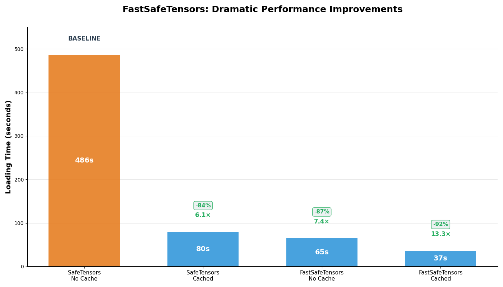

# Performance of FastSafeTensors on AMD GPUs

## DeepSeek-R1 vLLM Model Weight Loading Speed

This benchmark compares the performance of `safetensors` vs `fastsafetensors` when loading model weights on AMD GPUs.

NOTES: `fastsafetensors` does not support GDS feature on ROCm as there are no GDS alternative on ROCm.

### Benchmark Methodology

**Platform:** AMD ROCm 7.0.1
**GPUs:** 8x AMD Instinct MI300X
**Library:** fastsafetensors 0.1.15

1. **Clear system cache** to ensure consistent starting conditions:
   ```bash
   sudo sh -c 'sync && echo 3 > /proc/sys/vm/drop_caches'
   ```

2. **Launch vLLM** with either `--load-format safetensors` or `--load-format fastsafetensors`:

    ```bash
    MODEL=EmbeddedLLM/deepseek-r1-FP8-Dynamic

    VLLM_USE_V1=1 \
    VLLM_ROCM_USE_AITER=1 \
    vllm serve $MODEL \
    --tensor-parallel-size 8 \
    --disable-log-requests \
    --compilation-config '{"cudagraph_mode": "FULL_AND_PIECEWISE"}' \
    --trust-remote-code \
    --load-format fastsafetensors \
    --block-size 1
    ```

### Results

The experiments are carried on MI300X.

**Cache Scenarios:**
- **No cache**: Model weights are loaded after clearing the system cache (cold start).
- **Cached**: Model weights are loaded immediately after a previous load. The weights are cached in the filesystem and RAM (warm start).




## GPT-2 perf tests based on the script [perf/fastsafetensors_perf/perf.py](../perf/fastsafetensors_perf/perf.py)

### Test Configuration

All tests were performed on single-GPU loading scenarios with two different model sizes:
- **GPT-2 (small):** 523MB safetensors file
- **GPT-2 Medium:** ~1.4GB safetensors file

#### Key Parameters Tested:
- **nogds mode:** ROCm fallback (GDS not available on AMD GPUs)
- **Thread counts:** 8, 16, 32
- **Buffer sizes:** 8MB, 16MB, 32MB
- **Loading methods:** nogds (async I/O), mmap (memory-mapped)
- **Data types:** AUTO (no conversion), F16 (half precision conversion)

---

#### Performance Results

##### GPT-2 (523MB) - Single GPU Tests

| Test # | Method | Threads | Buffer | Config | Bandwidth | Elapsed Time | Notes |
|--------|--------|---------|--------|--------|-----------|--------------|-------|
| 1 | nogds | 16 | 16MB | default | **1.91 GB/s** | 0.268s | Baseline test |
| 2 | nogds | 32 | 32MB | default | **2.07 GB/s** | 0.246s | Higher threads/buffer |
| 3 | nogds | 8 | 8MB | default | **2.10 GB/s** | 0.243s | Lower threads/buffer |
| 4 | mmap | N/A | N/A | default | **1.01 GB/s** | 0.505s | Memory-mapped |
| 5 | nogds | 32 | 32MB | cache-drop | **1.24 GB/s** | 0.410s | Cold cache test |
| 6 | nogds | 32 | 32MB | F16 dtype | **0.77 GB/s** | 0.332s | With type conversion |
| 8 | nogds | 16 | 16MB | **optimal** | **2.62 GB/s** | 0.195s | Best config |

##### GPT-2 Medium (1.4GB) - Single GPU Tests

| Test # | Method | Threads | Buffer | Block Size | Bandwidth | Elapsed Time | Notes |
|--------|--------|---------|--------|------------|-----------|--------------|-------|
| 9 | nogds | 16 | 16MB | 160MB | **6.02 GB/s** | 0.235s | Optimal config |
| 10 | mmap | N/A | N/A | N/A | **1.28 GB/s** | 1.104s | Memory-mapped |
| 11 | nogds | 32 | 32MB | 160MB | **5.34 GB/s** | 0.265s | Higher threads |

---